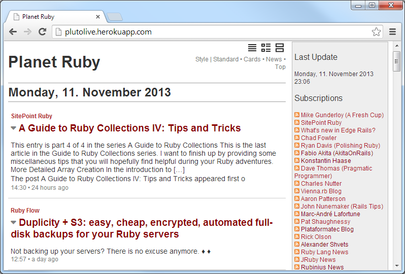

# Pluto Docs

A planet site generator in ruby that lets you build web pages from published web feeds.

- [What's Pluto? - Getting Started](#getting-started)
  - [top - Pluto Planet Template Pack](#top---pluto-planet-template-pack)
  - [digest - Pluto Planet Template Pack](#digest---pluto-planet-template-pack)
- [Planet Configuration](#planet-configuration)
- [Create Your Own Templates](#create-your-own-templates---template-reference)
  - [Planet Planet <=> Pluto - Template Cheatsheet](#planet-planet-----pluto---template-cheatsheet)
- [Commands, Commands, Commands](#commands-commands-commands)
- [About](#about)


## Getting Started

#### Step 1 - Add all web feeds to your planet configuration

Add all web feeds to add to your planet news site
to your planet configuration file.

Example - `planet.ini`:

```
title = Planet Ruby

[rubylang]
  title = Ruby Lang News
  link  = http://www.ruby-lang.org/en/news
  feed  = http://www.ruby-lang.org/en/feeds/news.rss

[rubyonrails]
  title = Ruby on Rails News
  link  = http://weblog.rubyonrails.org
  feed  = http://weblog.rubyonrails.org/feed/atom.xml

[viennarb]
  title = Vienna.rb News
  link  = http://vienna-rb.at
  feed  = http://vienna-rb.at/atom.xml
```


#### Step 2 - Auto-build your planet news site

Use the `pluto` command line tool and pass in the
planet configuration file. Example:

```
$ pluto build planet.ini
```

This will

1) fetch all feeds listed in `planet.ini` and

2) store all entries in a local database, that is, `planet.db` in your working folder and

3) generate a planet web page, that is, `planet.html` using the [`blank` template pack](https://github.com/planet-templates/planet-blank) in your working folder using all feed entries from the local database.

Open up `planet.html` to see your planet web page. Voila!





#### Bonus: Try different templates/theme packs

Don't like the look and feel of the built-in standard blank theme / template?
Use a different planet theme or design your own.

See the ["Planet Templates"](https://github.com/planet-templates) site for more free themes / templates including:

- Blank - default templates; [more »](https://github.com/planet-templates/planet-blank)
- News - 'river of news' style templates; [more »](https://github.com/planet-templates/planet-news)
- Top -  Popurl-style templates; [more »](https://github.com/planet-templates/planet-top)
- Classic -  Planet Planet-Style templates; [more »](https://github.com/planet-templates/planet-classic)


### top - Pluto Planet Template Pack

##### Screenshot - Preview


#### Usage

##### Try It Yourself - How To Use the Top Template Pack

If you want to try it yourself, install (fetch) the new template pack. Issue the command:

    $ pluto install top

Or as an alternative clone the template pack using `git`. Issue the commands:

    $ cd ~/.pluto
    $ git clone git://github.com/planet-templates/pluto.top.git

To check if the new template got installed, use the `list` command:

    $ pluto list

Listing something like:

    Installed templates include:
       top (~/.pluto/top/top.txt)

Showtime! Let's use the `-t/--template` switch to build a sample Planet Ruby. Example:

     $ pluto build ruby.yml --template top     or
     $ pluto b ruby -t top

Open up the generated planet page `ruby.html` in your browser. Voila. That's it.

### digest - Pluto Planet Template Pack

Design and layout inspired by [Alterslash - the unofficial Slashdot digest](http://alterslash.org). Easy to read single page digest.

##### Screenshot - Preview


#### Usage

##### Try It Yourself - How To Use the Digest Template Pack

If you want to try it yourself, install (fetch) the new template pack. Issue the command:

    $ pluto install digest

Or as an alternative clone the template pack using `git`. Issue the commands:

    $ cd ~/.pluto
    $ git clone git://github.com/planet-templates/planet-digest.git

To check if the new template got installed, use the `list` command:

    $ pluto list

Listing something like:

    Installed templates include:
       top (~/.pluto/digest/digest.txt)

Showtime! Let's use the `-t/--template` switch to build a sample Planet Ruby. Example:

     $ pluto build ruby.ini --template digest     or
     $ pluto b ruby -t digest

Open up the generated planet page `ruby.digest.html` in your browser. Voila. That's it.


## Planet Configuration

#### Samples

For more planet configuration samples
or real world setups (with live planet news sites) see the
[Planets](https://github.com/feedreader/planets) repo.
Samples include:

[`nytimes.ini`](https://github.com/feedreader/planets/blob/master/nytimes.ini),
[`js.ini`](https://github.com/feedreader/planet-web/blob/master/js.ini),
[`dart.ini`](https://github.com/feedreader/planet-web/blob/master/dart.ini),
[`haskell.ini`](https://github.com/feedreader/planets/blob/master/haskell.ini).

Real world setups include:

- [OpenStreetMap Blogs](https://blogs.openstreetmap.org) - [(Setup)](https://github.com/gravitystorm/blogs.osm.org)


## Create Your Own Templates - Template Reference

##### Embedded Ruby (ERB) Templates

Pluto uses "standard / plain vanilla" embedded ruby (ERB) templates.

To create your own templates use the built-in variables `site`, `feed`, `item`, etc.

#### Site

Example: Planet Title

```
<%= site.title %>
```


Example: List all subscriptions

```
<% site.feeds.each do |feed| %>
  <%= feed.url %>  or  <%= feed.link %>
  <%= feed.title %>  or  <%= feed.name %>
  <%= feed.title2 %>
  <%= feed.feed_url %>  or  <%= feed.feed %>
<% end %>
```


#### Feed

Example: Lastest feed items

```
<% items = site.items.latest.limit(24)
     ItemCursor.new( items ).each do |item,new_date,new_feed| %>

  <% if new_date %>
    <%= item.published %>
  <% end %>

  <% if new_feed %>
    <%= item.feed.url %>  or  <%= item.feed.link %>
    <%= item.feed.title %>  or  <%= item.feed.name %>
    <%= item.feed.title2 %>
  <% end %>

  <% if item.title %>
    <%= item.title %>
  <% end %>

  <% item.content %>
  <% item.url %>  or  <% item.link %>
  <% item.published %>

<% end %>
```

### Planet Planet <=> Pluto - Template Cheatsheet

#### What's Planet Planet?

Planet Planet is the very first planet feed reader coded in Python
by Scott James Remnant and Jeff Waugh [(Site)](https://web.archive.org/web/20170410004746/http://www.planetplanet.org/) - uses
Mark Pilgrim's universal feed parser (RDF, RSS and Atom)
and Tomas Styblo's templating engine; last release version 2.0 in 2006.

To help with converting your "classic" templates
to the new pluto machinery
using embedded ruby templates here's a cheatsheet.


#### Planet Planet <=> Pluto - Template Cheatsheet

    <TMPL_VAR name>                |  <%= site.title %>  or  <%= site.name %>
    <TMPL_VAR generator>           |  <%= Pluto.generator %>

    <TMPL_LOOP Channels>           |  <% site.feeds.each do |feed| %>
       <TMPL_VAR link>             |    <%= feed.url %>  or  <%= feed.link %>
       <TMPL_VAR name>             |    <%= feed.title %>  or  <%= feed.name %>
       <TMPL_VAR title>            |    <%= feed.title2 %>
       <TMPL_VAR url>              |    <%= feed.feed_url %>  or  <%= feed.feed %>
    </TMPL_LOOP>                   |  <% end %>

    <TMPL_LOOP Items>              |  <% items = site.items.latest.limit(24)
                                   |     ItemCursor.new( items ).each do |item,new_date,new_feed| %>
                                   |
      <TMPL_IF new_date>           |    <% if new_date %>
        <TMPL_VAR new_date>        |      <%= item.published %>
      </TMPL_IF>                   |    <% end %>
                                   |
      <TMPL_IF new_channel>        |    <% if new_feed %>
        <TMPL_VAR channel_link>    |      <%= item.feed.url %>  or  <%= item.feed.link %>
        <TMPL_VAR channel_name>    |      <%= item.feed.title %>  or  <%= item.feed.name %>
        <TMPL_VAR channel_title>   |      <%= item.feed.title2 %>
      </TMPL_IF>                   |    <% end %>
                                   |
      <TMPL_IF title>              |    <% if item.title %>
        <TMPL_VAR title>           |      <%= item.title %>
      </TMPL_IF>                   |    <% end %>
                                   |
      <TMPL_VAR content>           |    <% item.content %>
      <TMPL_VAR link>              |    <% item.url %>  or  <% item.link %>
      <TMPL_VAR date>              |    <% item.published %>
                                   |
      <TMPL_IF author>             |
        <TMPL_VAR author>          |    to be done
      </TMPL_IF>                   |
    </TMPL_LOOP>                   |  <% end %>

    <TMPL_VAR date>                |  <%= site.fetched %>     # site (planet) last updated

## Commands, Commands, Commands

Welcome to the pluto command line tool.
To see all commands type:

    $ pluto help


resulting in:

```
NAME
    pluto - another planet generator - lets you build web pages from published web feeds

SYNOPSIS
    pluto [global options] command [command options] [arguments...]

GLOBAL OPTIONS
    -c, --config=PATH - Configuration Path (default: ~/.pluto)
    -q, --quiet       - Only show warnings, errors and fatal messages
    --verbose         - (Debug) Show debug messages
    --version         - Display the program version
    --help            - Show this message

COMMANDS
    build, b      - Build planet
    install, i    - Install template pack
    list, ls, l   - List installed template packs
    update, up, u - Update planet feeds
    merge, m      - Merge planet template pack
    about, a      - (Debug) Show more version info
    help          - Shows a list of commands or help for one command
```

#### `build` Command

```
NAME
    build - Build planet

SYNOPSIS
    pluto [global options] build [command options] FILE

COMMAND OPTIONS
    -o, --output=PATH       - Output Path (default: .)
    -t, --template=MANIFEST - Template Manifest (default: blank)
    -d, --dbpath=PATH       - Database path (default: .)
    -n, --dbname=NAME       - Database name (default: <PLANET>.db e.g. ruby.db)

EXAMPLE
    pluto build ruby.yml
    pluto build ruby.yml --template news
    pluto b ruby
    pluto b ruby -t news
    pluto b            # will use pluto.ini|pluto.yml|planet.ini|planet.yml if present
```


#### `list` Command

```
NAME
    list - List installed template packs

SYNOPSIS
    pluto [global options] list

EXAMPLE
   pluto list
   pluto ls
```


#### `install` Command

```
NAME
    install - Install template pack

SYNOPSIS
    pluto [global options] install MANIFEST

EXAMPLE
   pluto install news      # install "river of news" template pack
```


#### `update` Command

```
NAME
    update - Update planet feeds

COMMAND OPTIONS
    -d, --dbpath=PATH       - Database path (default: .)
    -n, --dbname=NAME       - Database name (default: <PLANET>.db e.g. ruby.db)

SYNOPSIS
    pluto [global options] update FILE

EXAMPLE
    pluto update ruby.yml
    pluto u ruby
```


#### `merge` Command

```
NAME
    merge - Merge planet template pack

SYNOPSIS
    pluto [global options] merge [command options] FILE

COMMAND OPTIONS
    -o, --output=PATH       - Output Path (default: .)
    -t, --template=MANIFEST - Template Manifest (default: blank)
    -d, --dbpath=PATH       - Database path (default: .)
    -n, --dbname=NAME       - Database name (default: <PLANET>.db e.g. ruby.db)

EXAMPLE
    pluto merge ruby.yml
    pluto merge ruby.yml --template news
    pluto m ruby
    pluto m ruby -t news
```

## About

Gerald Bauer and contributors designed and developed the `pluto` gem.
See the change log for contributions and credits.

#### License

The pluto scripts and templates are dedicated to the public domain.
Use it as you please with no restrictions whatsoever.


#### Questions? Comments?

Send them along to the
[wwwmake mailing list/forum](http://groups.google.com/group/wwwmake).
Thanks!
